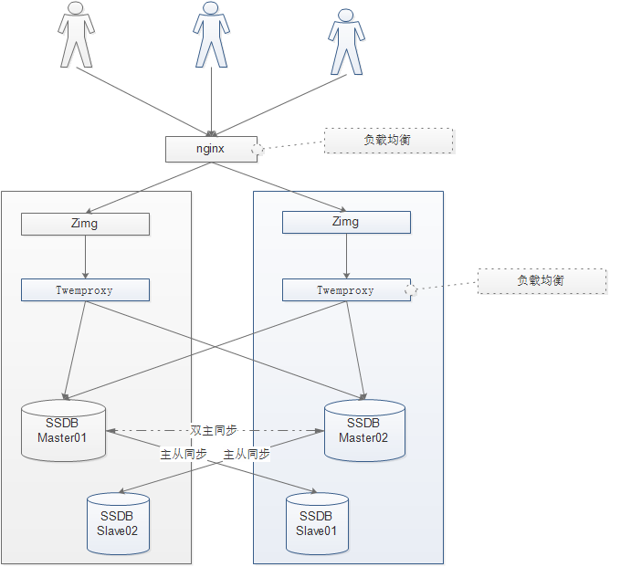
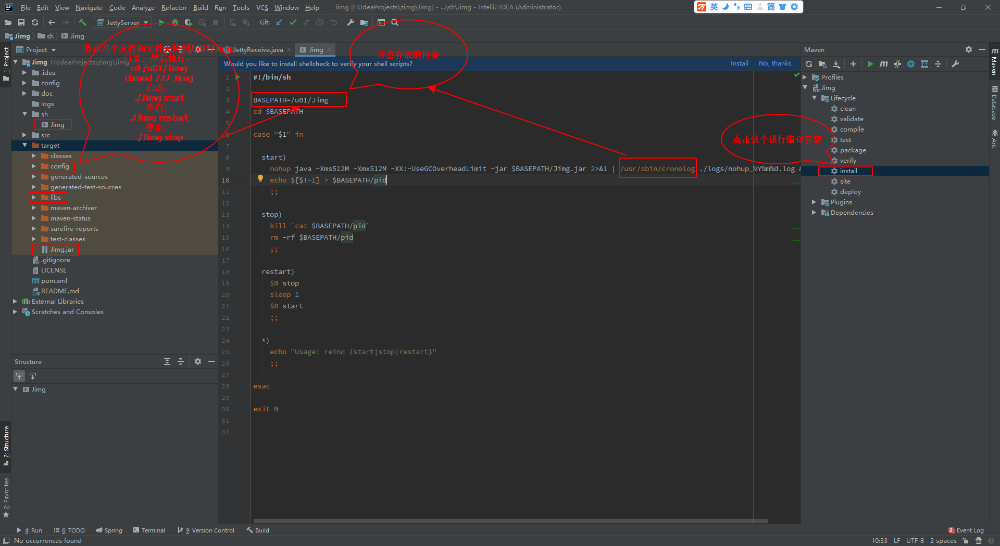
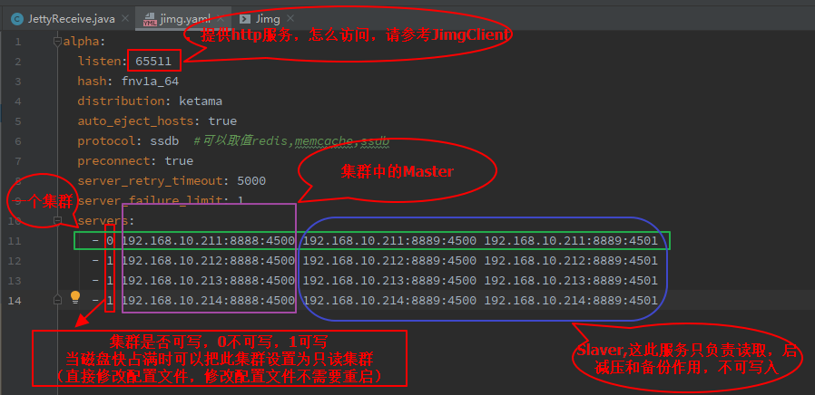

# Jimg

### Jimg使用框架：


Jimg是受zimg启发开发的，zimg非常好，但发现几个问题没有弄明白，所以直接自已写了个。

### zimg使用框架：



zimg没有明白的地方：

1、使用twemproxy，如果一个ssbd上的磁盘满了，或者压力过大，它是怎么不向这一台服务器上写的？

2、zimg这个程序似乎很容易挂掉，试过，如果关闭twemproxy，zimg这个程序就挂掉了。

3、怎么实现的如果某个master挂掉了，去slaver上取数据的？

4、修改配置能否不重启直接按新的配置提供服务？


鉴于以上问题，开发了Jimg，解决了以上问题，但现在只支持后端SSDB存储，后面考虑支持直接存入hadoop或其它支持分布式存储的db中。

## 程序功能：

1、SSDB集群管理,yaml文件动态加载，修改配置文件不需要重启服务，方便添加节点或者设置集群是否可写，SSDB集群如果有一台挂掉后不影响访问，集群的Master节点出问题后，自动写到其它集群，读取可以从Slaver节点读取，Master恢复后自动重新加回提供写入服务，如果一个集群挂掉会影响对本集群的读操作，但不影响数据的写入，数据会自动写入其它集群，如果一个SSDB占用的磁盘空间满后可以将此集群设置为只读集群，这样就不会再向此集群写入信息了，这样就保证了原来写入集群中的文件任然可以读取，而不需要做数据迁移或者扩容，只需要添加其它节点就可以了；
2、图片或文件或key值类数据上传和分发服务；
3、自身实现了集群管理，不再需要使有twemproxy，当然你也可以使用twemproxy做二级代理使用。


## 安装：

### 一、安装JDK（如果已有JDK则跳过此节，但是JDK是必须的，此版是基于JDK8开发的）

查看JDK信息：

[root@localhost ~]# rpm -qa | grep java

javapackages-tools-3.4.1-6.el7_0.noarch

tzdata-java-2014i-1.el7.noarch

java-1.7.0-openjdk-headless-1.7.0.71-2.5.3.1.el7_0.x86_64

java-1.7.0-openjdk-1.7.0.71-2.5.3.1.el7_0.x86_64

python-javapackages-3.4.1-6.el7_0.noarch

 

卸载OpenJDK，执行以下操作：

[root@localhost ~]# rpm -e --nodeps tzdata-java-2014i-1.el7.noarch

[root@localhost ~]# rpm -e --nodeps java-1.7.0-openjdk-headless-1.7.0.71-2.5.3.1.el7_0.x86_64

[root@localhost ~]# rpm -e --nodeps java-1.7.0-openjdk-1.7.0.71-2.5.3.1.el7_0.x86_64

 

rpm -e --nodeps tzdata-java*

rpm -e --nodeps java-1*

 

下载：

jdk-8u231-linux-x64.tar.gz

下载地址：http://www.oracle.com/technetwork/java/javase/downloads/index.html

 

解压：

tar zxvf jdk-8u231-linux-x64.tar.gz

cd jdk-8u231-linux-x64

 

修改系统环境变量文件

vi /etc/profile

 

向文件里面追加以下内容：

JAVA_HOME=/u01/jdk1.8.0_231

JRE_HOME=$JAVA_HOME/jre

PATH=$PATH:$JAVA_HOME/bin:$JRE_HOME/bin

CLASSPATH=.:$JAVA_HOME/lib/dt.jar:$JAVA_HOME/lib/tools.jar:$JRE_HOME/lib

export JAVA_HOME JRE_HOME PATH CLASSPATH

 

 

使修改生效

[root@localhost ~]# source /etc/profile  //使修改立即生效

[root@localhost ~]# echo $PATH  //查看PATH值

  

### 二、安装cronolog

```
wget http://cronolog.org/download/cronolog-1.6.2.tar.gz 

tar xf cronolog-1.6.2.tar.gz 

cd cronolog-1.6.2 

./configure 

make && make install 

which cronolog
```


### 二、安装ssdb

  1、安装

mkdir /u01

cd /u01

wget --no-check-certificate https://github.com/ideawu/ssdb/archive/master.zip
unzip master
cd ssdb-master
make

2、修改配置文件
vi /u01/ssdb-master/ssdb.conf
把server下的IP改为：0.0.0.0

vi /u01/ssdb-master/ssdb_slave.conf

修改replication中的host，指向Master的服务器地址。


3、设置SSDB为服务和开机启动

vi /etc/rc.d/init.d/ssdb

```
# /bin/sh 
# 
# chkconfig:345 98 98 
# description: SSDB is a fast NoSQL database for storing big list of billions of elements 
# processname:ssdb

case "$1" in 
  'start') 
    /u01/ssdb-master/ssdb-server -d /u01/ssdb-master/ssdb.conf 
    echo "ssdb started." 
    ;; 
  'stop') 
    kill `cat /u01/ssdb-master/var/ssdb.pid` 
    echo "ssdb stopped." 
    ;; 
  'restart') 
    kill `cat /u01/ssdb-master/var/ssdb.pid` 
    echo "ssdb stopped." 
    sleep 0.5 
    /u01/ssdb-master/ssdb-server -d /u01/ssdb-master/ssdb.conf 
    echo "ssdb started." 
    ;; 
  *) 
    echo "Usage: $0 {start|stop|restart}" 
    exit 1 
  ;; 
esac

exit 0
```

保存退出，然后设置权限
chmod 777 /etc/rc.d/init.d/ssdb  #赋予文件执行权限
chkconfig ssdb on  #设置开机启动
service ssdb start

  

### 三、安装jimg




将这几个文件和文件夹拷到/u01/Jimg目录，然后执行：

```

cd /u01/Jimg
chmod 777 Jimg
```

修改配置文件：

```
alpha:
  listen: 65511
  hash: fnv1a_64
  distribution: ketama
  auto_eject_hosts: true
  protocol: ssdb  #可以取值redis,memcache,ssdb
  preconnect: true
  server_retry_timeout: 5000
  server_failure_limit: 1
  servers:
    - 0 192.168.10.211:8888:4500 192.168.10.211:8889:4500 192.168.10.211:8889:4501
    - 1 192.168.10.212:8888:4500 192.168.10.212:8889:4500 192.168.10.212:8889:4501
    - 1 192.168.10.213:8888:4500 192.168.10.213:8889:4500 192.168.10.213:8889:4501
    - 1 192.168.10.214:8888:4500 192.168.10.214:8889:4500 192.168.10.214:8889:4501
```




```
启动：
./Jimg start
重启：
./Jimg restart
停止：
./Jimg stop
```


如何上传文件请参考：

```
JimgClient.java
```

 
